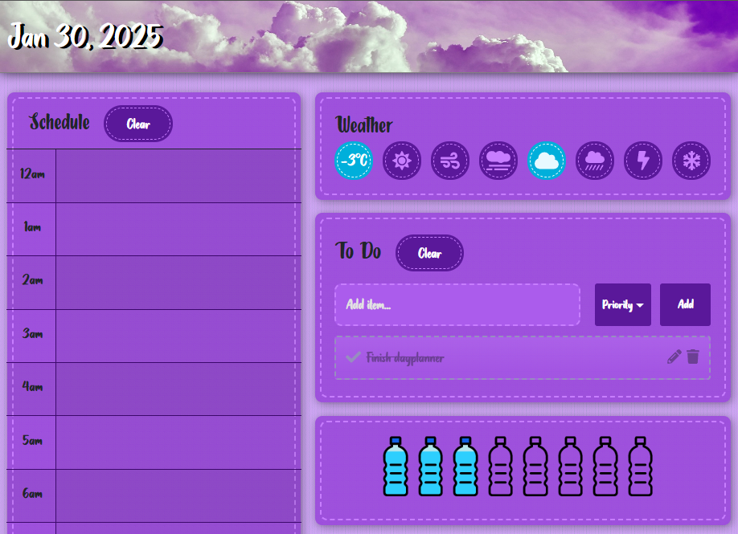

# React Dayplanner
](https://nodejs.org/download/)




## Table of contents
* [General info](#general-info)
* [Technologies](#technologies)
* [Setup](#setup)

## General info
V2 of a dayplanner I built a long time ago, this time done in React. You can view it at [https://react-dayplanner.herokuapp.com/](https://react-dayplanner.herokuapp.com/)
	
## Technologies
Project is created with:
* React
* Bootstrap 
* jQuery
	
## Setup
To run this project, install it locally using npm:

```
$ npm i
$ npm start
```